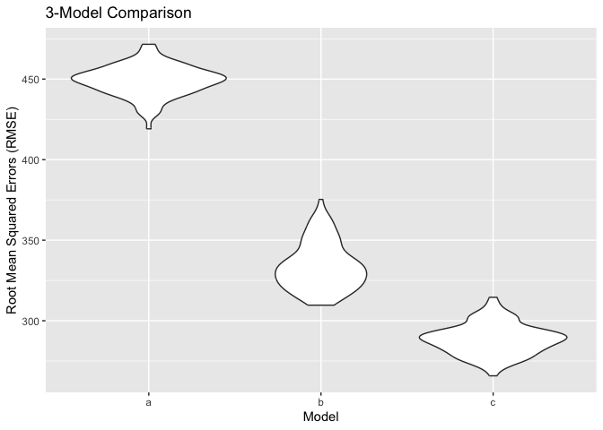

p8105_hw6_ak4598
================
Aleya Khalifa
2023-12-01

# Problem 2

## 2.1 Set up regression

``` r
fit2 = lm(tmax ~ tmin + prcp, data = weather_df)
```

Create desired output *without* uncertainty analysis

**r<sup>2</sup>**

``` r
fit2 %>% 
  broom::glance() %>%
  select(r.squared)
```

    ## # A tibble: 1 × 1
    ##   r.squared
    ##       <dbl>
    ## 1     0.916

log(β1\*β1)

``` r
beta1 = fit2 %>% 
  broom::tidy() %>%
  filter(term == "tmin") %>%
  select(estimate) %>%
  as.numeric()

beta2 = fit2 %>% 
  broom::tidy() %>%
  filter(term == "prcp") %>%
  select(estimate) %>%
  as.numeric()

log(abs(beta1) * abs(beta2))
```

    ## [1] -6.46219

## 2.2 Bootstrap

First, create bootstrap function

``` r
boot_sample = function(df) {
  sample_frac(df, replace = TRUE)
}
```

Then, draw 5,000 bootstrap samples.

``` r
boot_straps = 
  tibble(strap_number = 1:5000) %>% 
  mutate(
    strap_sample = map(strap_number, \(i) boot_sample(df = weather_df))
  )

boot_straps
```

    ## # A tibble: 5,000 × 2
    ##    strap_number strap_sample      
    ##           <int> <list>            
    ##  1            1 <tibble [365 × 6]>
    ##  2            2 <tibble [365 × 6]>
    ##  3            3 <tibble [365 × 6]>
    ##  4            4 <tibble [365 × 6]>
    ##  5            5 <tibble [365 × 6]>
    ##  6            6 <tibble [365 × 6]>
    ##  7            7 <tibble [365 × 6]>
    ##  8            8 <tibble [365 × 6]>
    ##  9            9 <tibble [365 × 6]>
    ## 10           10 <tibble [365 × 6]>
    ## # ℹ 4,990 more rows

Run above on the simulated 5,000 samples. For each bootstrap sample, I
produce estimates the two estimates above. I then summarize the 2.5 and
97.5 quantiles to show the 95% confidence interval.

**r<sup>2</sup>**

``` r
bootstrap_results = 
  boot_straps %>% 
  mutate(
    models = map(strap_sample, \(df) lm(tmax ~ tmin + prcp, data = df) ),
    results = map(models, broom::glance)) %>% 
  select(-strap_sample, -models) %>% 
  unnest(results) 

bootstrap_results %>% 
  summarize(lower_r2 = quantile(r.squared, .025),
            upper_r2 = quantile(r.squared, .975)) %>% 
  knitr::kable(digits = 3)
```

| lower_r2 | upper_r2 |
|---------:|---------:|
|    0.889 |    0.941 |

The table above shows the 95% confidence interval for the r<sup>2</sup>
term.

log(β1\*β1)

*Note: the log() function returns NaN if the value is negative, so here
I use the absolute value of `tmin`*

``` r
bootstrap_results = 
  boot_straps %>% 
  mutate(
    models = map(strap_sample, \(df) lm(tmax ~ tmin + prcp, data = df) ),
    results = map(models, broom::tidy)) %>% 
  select(-strap_sample, -models) %>% 
  unnest(results) 

bootstrap_results %>% 
  filter(term == "tmin" | term == "prcp") %>%
  select(strap_number, term, estimate) %>%
  pivot_wider(names_from = term, values_from = estimate) %>%
  mutate(log_betas = log(abs(tmin) * abs(prcp))) %>%
  summarize(lower = quantile(log_betas, .025, na.rm = TRUE),
         upper = quantile(log_betas, .975)) %>%
  knitr::kable(digits = 3)
```

|  lower |  upper |
|-------:|-------:|
| -8.589 | -4.592 |

The table above shows the 95% confidence interval for the log(β1\*β1)
term.

# Problem 3

## 3.1 Regression

Fit regression model that predicts baby’s birth weight in `bwt`. I posit
that the family’ monthly income `fincome`, its gestational age in weeks
`gaweeks`, mother’s race `mrace`, and mother’ pre-pregnancy BMI `ppbmi`
predict baby’s birth weight. First, I have to check the data quality in
these variables and clean. All are continuous except for `mrace`, so I
format that here. White will be the reference category.

``` r
birthweight = birthweight %>%
  mutate(mrace = factor(mrace,
                        levels = c(1,2,3,4),
                        labels = c("White",
                                      "Black",
                                      "Asian",
                                      "Puerto Rican")))
```

Check for missing data - none!

``` r
sapply(birthweight, function(x) sum(is.na(x))/nrow(birthweight))
```

    ##  babysex    bhead  blength      bwt    delwt  fincome    frace  gaweeks 
    ##        0        0        0        0        0        0        0        0 
    ##  malform menarche  mheight   momage    mrace   parity  pnumlbw  pnumsga 
    ##        0        0        0        0        0        0        0        0 
    ##    ppbmi     ppwt   smoken   wtgain 
    ##        0        0        0        0

Now I can fit the regression model.

``` r
fit3a = lm(bwt ~ fincome + gaweeks + mrace + ppbmi, 
          data = birthweight)
```

## 3.2 Model diagnostics

Let’s add residuals to a data frame.

``` r
residuals = modelr::add_residuals(birthweight, fit3a) %>%
  select(resid) %>%
  mutate(resid = as.numeric(resid)) %>%
  rowid_to_column("id")
```

And fitted values:

``` r
fitted = modelr::add_predictions(birthweight, fit3a) %>% 
  select(pred) %>%
  mutate(pred = as.numeric(pred)) %>%
  rowid_to_column("id")
```

Here is a plot of model residuals against fitted values.

``` r
diagnostics = full_join(residuals, fitted, by = "id")


ggplot(diagnostics, aes(x = pred, y = resid)) + 
  geom_point(size = 2, alpha = 0.8, shape = 21, color = "blue") + 
  labs(title = "Model fitted values vs. residuals",
       x = "Fitted value",
       y = "Residual")
```

<!-- -->

Since the points are around the 0-line for residuals, the relationship
seems to be linear. But since the mean residual doesn’t change with the
fitted values, the spread of residuals is not constant. There don’t seem
to be any stand-out outliers.

## 3.3 Cross-validation

Now let’s compare this model to two others.

`fit3b`: length at birth and gestational age as predictors (main effects
only)

``` r
fit3b = lm(bwt ~ blength + gaweeks, data = birthweight)
```

and `fit3c`: head circumference, length, sex, and all interactions
(including the three-way interaction) between these

``` r
fit3c = lm(bwt ~ bhead + blength + babysex + 
             bhead*babysex + blength*babysex + bhead*blength, 
           data = birthweight)
```

We can compare the three models using cross-validated prediction error.

``` r
cv_df = 
  crossv_mc(birthweight, 100) %>%
  mutate(
    train = map(train, as_tibble),
    test = map(test, as_tibble)) %>%
  mutate(
    fit3a = map(train, \(df) fit3a),
    fit3b  = map(train, \(df) fit3b),
    fit3c  = map(train, \(df) fit3c)) %>%
  mutate(
    rmse_a = map2_dbl(fit3a, test, \(mod, df) rmse(model = mod, data = df)),
    rmse_b = map2_dbl(fit3b, test, \(mod, df) rmse(model = mod, data = df)),
    rmse_c = map2_dbl(fit3c, test, \(mod, df) rmse(model = mod, data = df)))
```

We can compare the RMSEs of each visually, which gives us a picture of
prediction error.

``` r
cv_df %>%
  select(starts_with("rmse")) %>%
  pivot_longer(
    everything(),
    names_to = "model", 
    values_to = "rmse",
    names_prefix = "rmse_") %>%
  mutate(model = fct_inorder(model)) %>%
  ggplot(aes(x = model, y = rmse)) + 
  geom_violin() + 
  labs(title = "3-Model Comparison",
       x = "Model",
       y = "Root Mean Squared Errors (RMSE)")
```

<!-- -->

According to this plot, Model C seems to be the best at predicting
baby’s birthweight.
